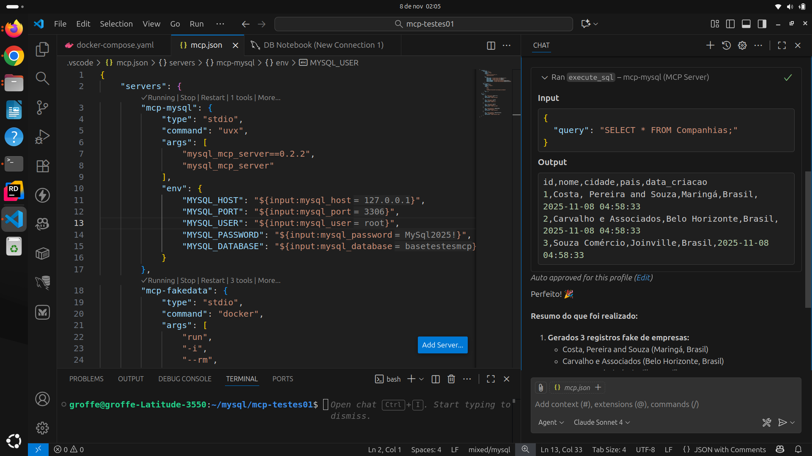

# mcp-mysql-fakedata
Tetes com MCP Server para MySQL (designcomputer/mysql_mcp_server), além do uso de um segundo MCP Server para geração de dados fake (imagem renatogroffe/dotnet9-consoleapp-mcp-fakedata).

Para realizar os testes com os MCP Servers indicados neste repo execute, primeiramente, o script **docker-compose.yaml** que está na pasta **scripts**.

Referências:
- Model Context Protocol: https://modelcontextprotocol.io/docs/getting-started/intro
- Docker MCP Hub: https://hub.docker.com/u/mcp
- MCP para MySQL (baseado em Python - package pip **mysql-mcp-server**): https://github.com/renatogroffe/mcp-mysql-fakedata
- MCP para geração de dados fake para testes (imagem Docker **renatogroffe/dotnet9-consoleapp-mcp-fakedata**): https://github.com/renatogroffe/dotnet9-consoleapp-mcp-fakedata

Na listagem seguinte temos um exemplo de **arquivo mcp.json** com os 2 MCP Servers configurados para testes:

```json
{
	"servers": {
		"mcp-mysql": {
			"type": "stdio",
			"command": "uvx",
			"args": [
				"mysql_mcp_server==0.2.2",
				"mysql_mcp_server"
			],
			"env": {
				"MYSQL_HOST": "${input:mysql_host}",
				"MYSQL_PORT": "${input:mysql_port}",
				"MYSQL_USER": "${input:mysql_user}",
				"MYSQL_PASSWORD": "${input:mysql_password}",
				"MYSQL_DATABASE": "${input:mysql_database}"
			}
		},
		"mcp-fakedata": {
			"type": "stdio",
			"command": "docker",
			"args": [
				"run",
				"-i",
				"--rm",
				"renatogroffe/dotnet9-consoleapp-mcp-fakedata"
			],
			"env": {}
		}
	},
	"inputs": [
		{
			"id": "mysql_host",
			"type": "promptString",
			"description": "MySQL Hostname"
		},
		{
			"id": "mysql_port",
			"type": "promptString",
			"description": "MySQL Port"
		},
		{
			"id": "mysql_user",
			"type": "promptString",
			"description": "MySQL Username"
		},
		{
			"id": "mysql_password",
			"type": "promptString",
			"description": "MySQL Password"
		},
		{
			"id": "mysql_database",
			"type": "promptString",
			"description": "MySQL Database Name"
		}
	]
}
```

No print a seguir podemos observar os resultados gerados a partir do uso do **Visual Studio Code + GitHub Copilot**:

